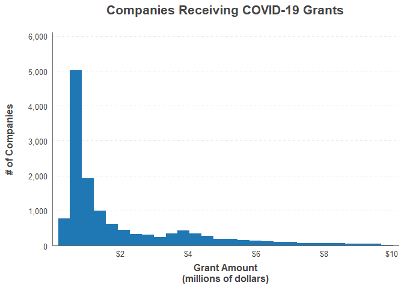
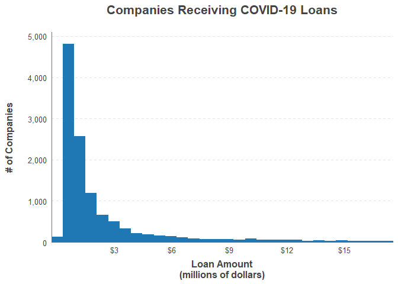
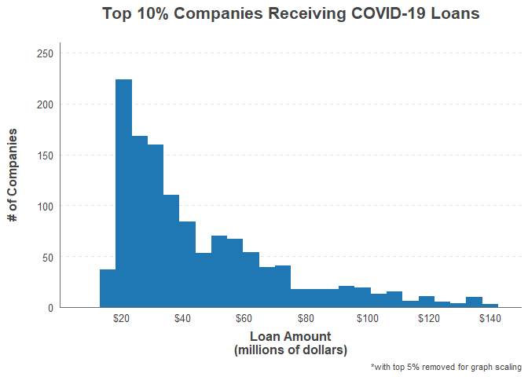
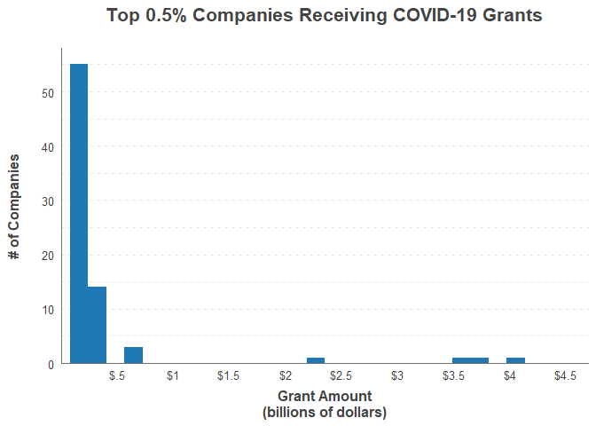
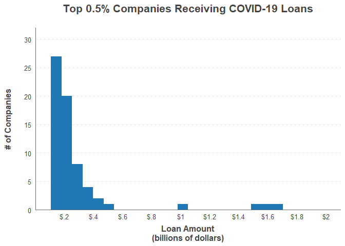
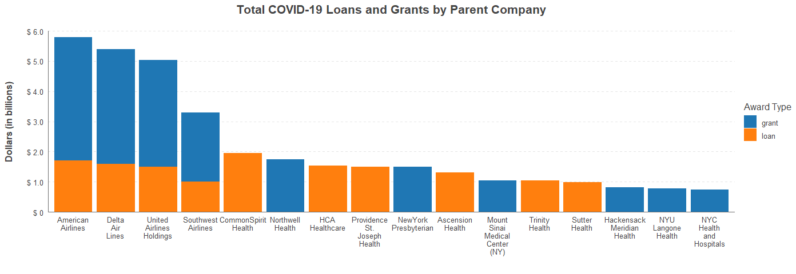

COVID-19 Facts and Figures
================

# Facts

  - <B>44.06%</B> of grant recipients were given between $500k and $1m

  - <B>45.35%</B> of loan recipients were given between $500k and $1m

  - <B>8</B> grant recipients were given $400m or more

  - <B>7</B> loan recipients were given $400m or more

  - The top 10 parent company grant recipients were given around
    <B>$20.4 billion dollars</B> - about <B>22.64%</B> of the
    distributed grant funds

  - The top 10 parent company loan recipients were given around <B>$14.1
    billion dollars</B> - about <B>13.54%</B> of the distributed loan
    funds

# Tables

<table>

<caption>

Companies Receiving COVID-19 Grants of over $400m

</caption>

<thead>

<tr>

<th style="text-align:left;">

Recipient Company

</th>

<th style="text-align:left;">

Grant Amount (millions)

</th>

</tr>

</thead>

<tbody>

<tr>

<td style="text-align:left;">

American Airlines Inc. 

</td>

<td style="text-align:left;">

$ 4,100

</td>

</tr>

<tr>

<td style="text-align:left;">

Delta Air Lines Inc. 

</td>

<td style="text-align:left;">

$ 3,800

</td>

</tr>

<tr>

<td style="text-align:left;">

United Airlines Inc. 

</td>

<td style="text-align:left;">

$ 3,500

</td>

</tr>

<tr>

<td style="text-align:left;">

Southwest Airlines Co. 

</td>

<td style="text-align:left;">

$ 2,300

</td>

</tr>

<tr>

<td style="text-align:left;">

Alaska Airlines Inc. 

</td>

<td style="text-align:left;">

$ 725

</td>

</tr>

<tr>

<td style="text-align:left;">

Jetblue Airways Corporation

</td>

<td style="text-align:left;">

$ 685

</td>

</tr>

<tr>

<td style="text-align:left;">

The New York And Presbyterian Hospital

</td>

<td style="text-align:left;">

$ 567

</td>

</tr>

<tr>

<td style="text-align:left;">

Nyu Langone Hospitals

</td>

<td style="text-align:left;">

$ 403

</td>

</tr>

</tbody>

</table>

<table>

<caption>

Companies Receiving COVID-19 Loans of over $400m

</caption>

<thead>

<tr>

<th style="text-align:left;">

Recipient Company

</th>

<th style="text-align:left;">

Loan Amount (millions)

</th>

</tr>

</thead>

<tbody>

<tr>

<td style="text-align:left;">

American Airlines

</td>

<td style="text-align:left;">

$ 1,700

</td>

</tr>

<tr>

<td style="text-align:left;">

Delta Air Lines, Inc. 

</td>

<td style="text-align:left;">

$ 1,600

</td>

</tr>

<tr>

<td style="text-align:left;">

United Airlines

</td>

<td style="text-align:left;">

$ 1,500

</td>

</tr>

<tr>

<td style="text-align:left;">

Southwest Airlines

</td>

<td style="text-align:left;">

$ 1,000

</td>

</tr>

<tr>

<td style="text-align:left;">

The New York And Presbyterian H

</td>

<td style="text-align:left;">

$ 523

</td>

</tr>

<tr>

<td style="text-align:left;">

NYU Langone Hospitals

</td>

<td style="text-align:left;">

$ 433

</td>

</tr>

<tr>

<td style="text-align:left;">

Memorial Hospital For Cancer An

</td>

<td style="text-align:left;">

$ 400

</td>

</tr>

</tbody>

</table>

<table>

<caption>

Top 10 Parent Companies Receiving COVID-19 Grants

</caption>

<thead>

<tr>

<th style="text-align:left;">

Parent Company

</th>

<th style="text-align:left;">

Grant Amount (billions)

</th>

</tr>

</thead>

<tbody>

<tr>

<td style="text-align:left;">

American Airlines

</td>

<td style="text-align:left;">

$ 4.10

</td>

</tr>

<tr>

<td style="text-align:left;">

Delta Air Lines

</td>

<td style="text-align:left;">

$ 3.80

</td>

</tr>

<tr>

<td style="text-align:left;">

United Airlines Holdings

</td>

<td style="text-align:left;">

$ 3.54

</td>

</tr>

<tr>

<td style="text-align:left;">

Southwest Airlines

</td>

<td style="text-align:left;">

$ 2.30

</td>

</tr>

<tr>

<td style="text-align:left;">

Northwell Health

</td>

<td style="text-align:left;">

$ 1.74

</td>

</tr>

<tr>

<td style="text-align:left;">

NewYork-Presbyterian

</td>

<td style="text-align:left;">

$ 1.50

</td>

</tr>

<tr>

<td style="text-align:left;">

Mount Sinai Medical Center (NY)

</td>

<td style="text-align:left;">

$ 1.04

</td>

</tr>

<tr>

<td style="text-align:left;">

Hackensack Meridian Health

</td>

<td style="text-align:left;">

$ 0.82

</td>

</tr>

<tr>

<td style="text-align:left;">

NYU Langone Health

</td>

<td style="text-align:left;">

$ 0.77

</td>

</tr>

<tr>

<td style="text-align:left;">

NYC Health and Hospitals

</td>

<td style="text-align:left;">

$ 0.74

</td>

</tr>

</tbody>

</table>

<table>

<caption>

Top 10 Parent Companies Receiving COVID-19 Loans

</caption>

<thead>

<tr>

<th style="text-align:left;">

Parent Company

</th>

<th style="text-align:left;">

Loan Amount (billions)

</th>

</tr>

</thead>

<tbody>

<tr>

<td style="text-align:left;">

CommonSpirit Health

</td>

<td style="text-align:left;">

$ 1.94

</td>

</tr>

<tr>

<td style="text-align:left;">

American Airlines

</td>

<td style="text-align:left;">

$ 1.70

</td>

</tr>

<tr>

<td style="text-align:left;">

Delta Air Lines

</td>

<td style="text-align:left;">

$ 1.60

</td>

</tr>

<tr>

<td style="text-align:left;">

HCA Healthcare

</td>

<td style="text-align:left;">

$ 1.54

</td>

</tr>

<tr>

<td style="text-align:left;">

Providence St. Joseph Health

</td>

<td style="text-align:left;">

$ 1.50

</td>

</tr>

<tr>

<td style="text-align:left;">

United Airlines Holdings

</td>

<td style="text-align:left;">

$ 1.50

</td>

</tr>

<tr>

<td style="text-align:left;">

Ascension Health

</td>

<td style="text-align:left;">

$ 1.31

</td>

</tr>

<tr>

<td style="text-align:left;">

Trinity Health

</td>

<td style="text-align:left;">

$ 1.04

</td>

</tr>

<tr>

<td style="text-align:left;">

Southwest Airlines

</td>

<td style="text-align:left;">

$ 1.00

</td>

</tr>

<tr>

<td style="text-align:left;">

Sutter Health

</td>

<td style="text-align:left;">

$ 0.98

</td>

</tr>

</tbody>

</table>

# Graphs

<!-- --><!-- -->

<!-- --><!-- -->

<!-- --><!-- -->

<!-- -->
