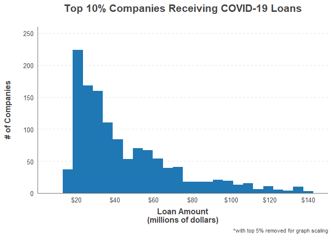

Results: COVID-19 Loan Distributions
================

All information was gathered using data from
<https://data.covidstimuluswatch.org/prog.php?&detail=export_csv> . Some
recipient names are cut off in the file.

## Facts

  - <B>44.06%</B> of grant recipients were given between $500k and $1m
  - <B>45.35%</B> of loan recipients were given between $500k and $1m
  - <B>8</B> grant recipients were given $400m or more
  - <B>7</B> loan recipients were given $400m or more

## Tables

<table>

<caption>

Companies Receiving COVID-19 Grants of over $400m

</caption>

<thead>

<tr>

<th style="text-align:left;">

Recipient Company

</th>

<th style="text-align:left;">

Grant Amount (millions)

</th>

</tr>

</thead>

<tbody>

<tr>

<td style="text-align:left;">

American Airlines Inc. 

</td>

<td style="text-align:left;">

$ 4,100

</td>

</tr>

<tr>

<td style="text-align:left;">

Delta Air Lines Inc. 

</td>

<td style="text-align:left;">

$ 3,800

</td>

</tr>

<tr>

<td style="text-align:left;">

United Airlines Inc. 

</td>

<td style="text-align:left;">

$ 3,500

</td>

</tr>

<tr>

<td style="text-align:left;">

Southwest Airlines Co. 

</td>

<td style="text-align:left;">

$ 2,300

</td>

</tr>

<tr>

<td style="text-align:left;">

Alaska Airlines Inc. 

</td>

<td style="text-align:left;">

$ 725

</td>

</tr>

<tr>

<td style="text-align:left;">

Jetblue Airways Corporation

</td>

<td style="text-align:left;">

$ 685

</td>

</tr>

<tr>

<td style="text-align:left;">

The New York And Presbyterian Hospital

</td>

<td style="text-align:left;">

$ 567

</td>

</tr>

<tr>

<td style="text-align:left;">

Nyu Langone Hospitals

</td>

<td style="text-align:left;">

$ 403

</td>

</tr>

</tbody>

</table>

<table>

<caption>

Companies Receiving COVID-19 Loans of over $400m

</caption>

<thead>

<tr>

<th style="text-align:left;">

Recipient Company

</th>

<th style="text-align:left;">

Loan Amount (millions)

</th>

</tr>

</thead>

<tbody>

<tr>

<td style="text-align:left;">

American Airlines

</td>

<td style="text-align:left;">

$ 1,700

</td>

</tr>

<tr>

<td style="text-align:left;">

Delta Air Lines, Inc. 

</td>

<td style="text-align:left;">

$ 1,600

</td>

</tr>

<tr>

<td style="text-align:left;">

United Airlines

</td>

<td style="text-align:left;">

$ 1,500

</td>

</tr>

<tr>

<td style="text-align:left;">

Southwest Airlines

</td>

<td style="text-align:left;">

$ 1,000

</td>

</tr>

<tr>

<td style="text-align:left;">

The New York And Presbyterian H

</td>

<td style="text-align:left;">

$ 523

</td>

</tr>

<tr>

<td style="text-align:left;">

NYU Langone Hospitals

</td>

<td style="text-align:left;">

$ 433

</td>

</tr>

<tr>

<td style="text-align:left;">

Memorial Hospital For Cancer An

</td>

<td style="text-align:left;">

$ 400

</td>

</tr>

</tbody>

</table>

## Graphs

The below graphs show how COVID-19 grants & loans were distributed
amongst the lower 90% of recipients

<!-- --><!-- -->

The below graphs show how COVID-19 grants & loans were distributed
amongst the top 10% through top 0.5% of recipients

<!-- --><!-- -->

The below graphs show how COVID-19 grants & loans were distributed
amongst the top 0.5% of recipients

<!-- --><!-- -->
