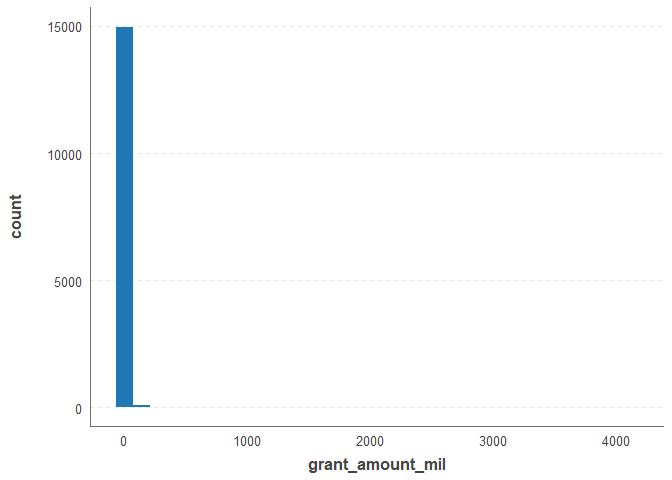
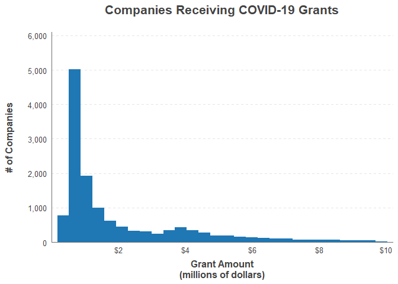
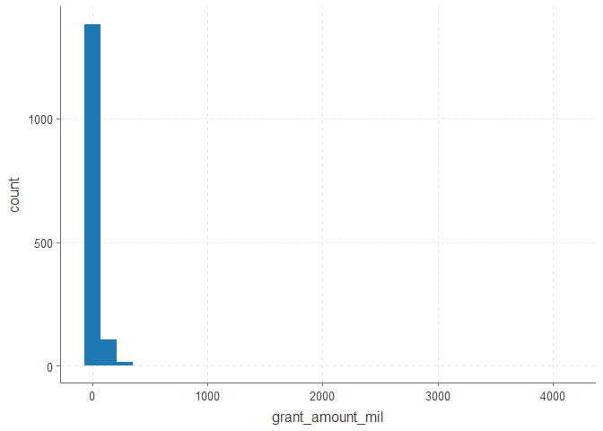
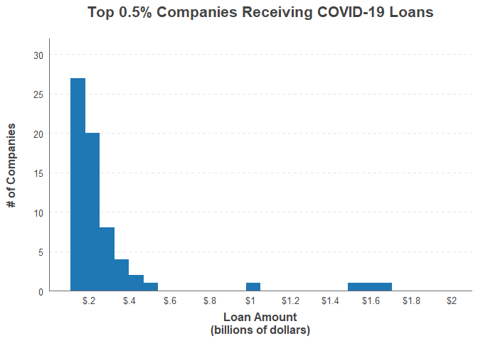

Part 2: COVID-19 Loan Distributions
================

For part 2, we are going to look at how loans and grants are distributed
amongst companies and parent companies. We will get into dividing the
companies based on research questions in later pages.

## Load data

First, load the packages and read the data from part 1.

``` r
options(scipen = 999) # to avoid exponent symbol in number representations
library(dplyr)
library(stringr)
library(ggplot2) # for graphing
library(ggthemr) # set theme for graphs
source('../functions/add_thousands_comma.R')

df <- read.csv('../data/formatted_loan_data_6_17.csv', header = TRUE)
```

We will also load my favorite non-academic graphing theme that I
included in the “plot\_themes” folder.

``` r
source('../plot_themes/bar_graph_theme.R')
```

## Analysis

##### How is grant money distributed amongst recipients?

Your best 2 options for visualization of distributions would be a
histogram or a density plot. We will go with the former.

``` r
df.grant <- df %>% 
  filter(award_type == 'grant' & grant_amount > 0) %>%
  mutate(grant_amount_mil = grant_amount / 1000000)

grant.p1 <- ggplot(df.grant) +
  geom_histogram(aes(grant_amount_mil), bins = 30) +
  theme.tweaks.bar

grant.p1
```

<!-- -->

As we will see in part 3, there are some outliers that ruin the scaling
of this graph. Since we look at this later, we can remove them for the
purpose of this page. Let’s cut off, say, the top 10%.

``` r
df.grant.90 <- df.grant %>% filter(grant_amount < (quantile(df.grant$grant_amount, .90)))

grant.p2 <- ggplot(df.grant.90) +
  geom_histogram(aes(grant_amount_mil), bins = 30) +
  scale_y_continuous(limits = c(0, 6100),
                     breaks = c(0, 1000, 2000, 3000, 4000, 5000, 6000),
                     labels = add_thousands_comma(c(0, 1000, 2000, 3000, 4000, 5000, 6000)),
                     expand = c(0,0)) +
  labs(
    title = 'Companies Receiving COVID-19 Grants',
    x = 'Grant Amount\n(millions of dollars)',
    y = '# of Companies'
  ) +
  scale_x_continuous(limits = c(0, 10.2),
                     breaks = c(0, 2, 4, 6, 8, 10),
                     labels = c('', '$2', '$4', '$6', '$8', '$10'),
                     expand = c(0,0)) +
  theme.tweaks.bar

grant.p2
```

<!-- -->

That’s a lot better. It looks like a pretty solid number of the
companies received loans between $500k and $1m. How many of them is that
compared to the whole?

``` r
num.between <- df.grant %>%
  filter(grant_amount >= 500000 & grant_amount <= 1000000) %>%
  distinct(recipient_company) %>% # remove companies that received multiple grants
  nrow()

grant.perc.500k.1m <- (num.between / (nrow(df.grant %>% distinct(recipient_company)))) * 100
grant.perc.500k.1m <- round(grant.perc.500k.1m, 2)

print(grant.perc.500k.1m)
```

    ## [1] 44.06

So about 44.06% of companies received a grant between $500,000 and
$1,000,000.

##### How is loan money distributed amongst recipients?

Now we want to look at loans through the same process.

``` r
df.loan <- df %>% 
  filter(award_type == 'loan' & face_loan_amount > 0) %>%
  mutate(face_loan_amount_mil = face_loan_amount / 1000000)
```

We remove the top 10% again to be consistent.

``` r
df.loan.90 <- df.loan %>% filter(face_loan_amount < (quantile(df.loan$face_loan_amount, .90)))

loan.p1 <- ggplot(df.loan.90) +
  geom_histogram(aes(face_loan_amount_mil), bins = 30) +
  scale_y_continuous(limits = c(0, 5100),
                     breaks = c(0, 1000, 2000, 3000, 4000, 5000),
                     labels = add_thousands_comma(c(0, 1000, 2000, 3000, 4000, 5000)),
                     expand = c(0,0)) +
  labs(
    title = 'Companies Receiving COVID-19 Loans',
    x = 'Loan Amount\n(millions of dollars)',
    y = '# of Companies'
  ) +
  scale_x_continuous(breaks = c(0, 3, 6, 9, 12, 15),
                     labels = c('', '$3', '$6', '$9', '$12', '$15'),
                     expand = c(0,0)) +
  theme.tweaks.bar

loan.p1
```

<!-- -->

The loans also seem to be most commonly between $500k and $1m. How many
of them is that compared to the whole?

``` r
num.between <- df.loan %>%
  filter(face_loan_amount >= 500000 & face_loan_amount <= 1000000) %>%
  distinct(recipient_company) %>% # remove companies that received multiple grants
  nrow()

loan.perc.500k.1m <- (num.between / (nrow(df.loan %>% distinct(recipient_company)))) * 100
loan.perc.500k.1m <- round(loan.perc.500k.1m, 2)
print(loan.perc.500k.1m)
```

    ## [1] 45.35

So about 45.35% of companies received a loan between $500,000 and
$1,000,000. Extremely close to the percentage we see with grants.

## Top 10%

We looked at how the lower 90% is distributed. But how do companies that
were in the top 10% look?

##### How is grant money distributed amongst the upper 10%?

``` r
df.grant.10 <- df.grant %>% filter(grant_amount > (quantile(df.grant$grant_amount, .90)))

grant.p3 <- ggplot(df.grant.10) +
  geom_histogram(aes(grant_amount_mil), bins = 30)

grant.p3
```

<!-- -->

Like the lower 90%, this isn’t exactly an ideal graph scaling. For
graphing, we’ll have to split these up. One way to find a cutoff value
is to find what values are influencing the weights of ggplot2’s scaling.

``` r
quants <- sapply(seq(0, 1, 0.05), function(x) { quantile(df.grant.10$grant_amount, x) })
print(quants)
```

    ##         0%         5%        10%        15%        20%        25% 
    ##    9858000   10362518   10992243   11762561   12390298   13135674 
    ##        30%        35%        40%        45%        50%        55% 
    ##   14234219   15371537   16401053   17893782   18877091   20309159 
    ##        60%        65%        70%        75%        80%        85% 
    ##   22050085   24034582   26937934   32835889   38640626   47980437 
    ##        90%        95%       100% 
    ##   62824253   96953106 4100000000

Just by eyeballing, the largest gap in quantiles is pretty clearly
between 95% and 100%.

``` r
diff(quants)
```

    ##           5%          10%          15%          20%          25% 
    ##     504518.0     629725.0     770318.0     627737.0     745376.0 
    ##          30%          35%          40%          45%          50% 
    ##    1098545.0    1137318.0    1029516.0    1492728.5     983309.5 
    ##          55%          60%          65%          70%          75% 
    ##    1432068.0    1740926.0    1984497.0    2903352.0    5897954.5 
    ##          80%          85%          90%          95%         100% 
    ##    5804737.5    9339811.0   14843816.0   34128853.0 4003046894.0

This shows the difference in dollars between x percentile and x-1
percentile cutoffs. Seems to support the above observation, so we’ll
just look at the lower 95% (of the overall top 10%). This isn’t to say
that the top 5% is not of interest - it just isn’t part of the current
goal.

``` r
df.grant.10 <- df.grant.10 %>% filter(grant_amount < (quantile(df.grant.10$grant_amount, .95)))

grant.p4 <- ggplot(df.grant.10) +
  geom_histogram(aes(grant_amount_mil), bins = 30) +
  scale_y_continuous(limits = c(0, 310),
                     breaks = c(0, 50, 100, 150, 200, 250, 300),
                     labels = c(0, 50, 100, 150, 200, 250, 300),
                     expand = c(0,0)) +
  labs(
    title = 'Top 10% Companies Receiving COVID-19 Grants',
    caption = '*with top 5% removed for graph scaling',
    x = 'Grant Amount\n(millions of dollars)',
    y = '# of Companies'
  ) +
  scale_x_continuous(limits = c(-0.2, 65), 
                     breaks = c(0, 10, 20, 30, 40, 50, 60),
                     labels = c('', '$10', '$20', '$30', '$40', '$50', '$60'),
                     expand = c(0,0)) +
  theme.tweaks.bar

grant.p4
```

<!-- -->

## Now rinse and repeat

##### How is loan money distributed amongst the upper 10%?

``` r
df.loan.10 <- df.loan %>% filter(face_loan_amount > (quantile(df.loan$face_loan_amount, .90)))
df.loan.10.2 <- df.loan.10 %>% filter(face_loan_amount < (quantile(df.loan.10$face_loan_amount, .95)))

loan.p2 <- ggplot(df.loan.10.2) +
  geom_histogram(aes(face_loan_amount_mil), bins = 30) +
  scale_y_continuous(limits = c(0, 260),
                     breaks = c(0, 50, 100, 150, 200, 250),
                     labels = c(0, 50, 100, 150, 200, 250),
                     expand = c(0,0)) +
  labs(
    title = 'Top 10% Companies Receiving COVID-19 Loans',
    caption = '*with top 5% removed for graph scaling',
    x = 'Loan Amount\n(millions of dollars)',
    y = '# of Companies'
  ) +
  scale_x_continuous(limits = c(-0.2, 150),
                     breaks = c(0, 20, 40, 60, 80, 100, 120, 140),
                     labels = c('', '$20', '$40', '$60', '$80', '$100', '$120', '$140'),
                     expand = c(0,0)) +
  theme.tweaks.bar

loan.p2
```

<!-- -->

## Top 0.5%

We have looked at the lower 90% of companies and the top 10% of
companies with the top 5% of that removed. So, in terms of overall
percentages, our last stop is looking at the top 0.5%.

##### How is grant money distributed amongst the top 0.5% of recipients?

``` r
df.grant.05 <- df.grant %>% filter(grant_amount > (quantile(df.grant$grant_amount, .995)))

grant.p5 <- ggplot(df.grant.05) +
  geom_histogram(aes(grant_amount_mil), bins = 30) +
  scale_y_continuous(limits = c(0, 58),
                     breaks = c(0, 5, 10, 15, 20, 25, 30, 35, 40, 45, 50, 55),
                     labels = c(0, '', 10, '', 20, '', 30, '', 40, '', 50, ''),
                     expand = c(0,0)) +
  labs(
    title = 'Top 0.5% Companies Receiving COVID-19 Grants',
    x = 'Grant Amount\n(billions of dollars)',
    y = '# of Companies'
  ) +
  scale_x_continuous(breaks = c(0, 500, 1000, 1500, 2000, 2500, 3000, 3500, 4000, 4500),
                     labels = c('', '$.5', '$1', '$1.5', '$2', '$2.5', '$3', '$3.5', '$4', '$4.5'),
                     limits = c(-0.2, 4700),
                     expand = c(0,0)) +
  theme.tweaks.bar

grant.p5
```

<!-- -->

It looks like our outliers received $400 million or more in grants. What
companies are these?

``` r
fohund.milplus <- df.grant %>%
  filter(grant_amount_mil >= 400) %>%
  mutate(recipient_company = as.character(recipient_company))

fohund.milplus <- fohund.milplus %>%
  arrange(desc(grant_amount_mil)) %>%
  select(`Recipient Company` = recipient_company,
         `Grant Amount (millions)` = grant_amount_mil) 
print(fohund.milplus)
```

    ##                        Recipient Company Grant Amount (millions)
    ## 1                 American Airlines Inc.               4100.0000
    ## 2                   Delta Air Lines Inc.               3800.0000
    ## 3                   United Airlines Inc.               3500.0000
    ## 4                 Southwest Airlines Co.               2300.0000
    ## 5                   Alaska Airlines Inc.                725.0000
    ## 6            Jetblue Airways Corporation                685.1000
    ## 7 The New York And Presbyterian Hospital                567.2851
    ## 8                  Nyu Langone Hospitals                403.3393

``` r
fohund.print <- paste(fohund.milplus$`Recipient Company`, collapse = ', ') # for dynamic markdown content
```

8 companies received $400 million or more in grants. These companies are
American Airlines Inc., Delta Air Lines Inc., United Airlines Inc.,
Southwest Airlines Co., Alaska Airlines Inc., Jetblue Airways
Corporation, The New York And Presbyterian Hospital, Nyu Langone
Hospitals.

##### How is loan money distributed amongst the top 0.5% of recipients?

``` r
df.loan.05 <- df.loan %>% filter(face_loan_amount > (quantile(df.loan$face_loan_amount, .995)))
 
loan.p3 <- ggplot(df.loan.05) +
  geom_histogram(aes(face_loan_amount_mil), bins = 30) +
  scale_y_continuous(limits = c(0, 32),
                     breaks = c(0, 5, 10, 15, 20, 25, 30),
                     expand = c(0,0)) +
  labs(
    title = 'Top 0.5% Companies Receiving COVID-19 Loans',
    x = 'Loan Amount\n(billions of dollars)',
    y = '# of Companies'
  ) +
  scale_x_continuous(breaks = c(0, 200, 400, 600, 800, 1000, 1200, 1400, 1600, 1800, 2000),
                     labels = c('', '$.2', '$.4', '$.6', '$.8', '$1', '$1.2', '$1.4', '$1.6', '$1.8', '$2'),
                     limits = c(0, 2100),
                     expand = c(0,0)) +
  theme.tweaks.bar

loan.p3
```

<!-- -->

Like grants, it looks like our outliers received $400 million or more in
loans. What companies are these?

``` r
fohund.milplus2 <- df.loan %>%
  filter(face_loan_amount_mil >= 400) %>%
  mutate(recipient_company = as.character(recipient_company))

fohund.milplus2 <- fohund.milplus2 %>%
  arrange(desc(face_loan_amount_mil)) %>%
  select(`Recipient Company` = recipient_company,
         `Loan Amount (millions)` = face_loan_amount_mil) 
print(fohund.milplus2)
```

    ##                 Recipient Company Loan Amount (millions)
    ## 1               American Airlines              1700.0000
    ## 2           Delta Air Lines, Inc.              1600.0000
    ## 3                 United Airlines              1500.0000
    ## 4              Southwest Airlines              1000.0000
    ## 5 The New York And Presbyterian H               522.8010
    ## 6           NYU Langone Hospitals               432.7736
    ## 7 Memorial Hospital For Cancer An               400.0000

``` r
fohund.print2 <- paste(fohund.milplus2$`Recipient Company`, collapse = ', ') 
```

7 companies received $400 million or more in loans. These companies are
American Airlines, Delta Air Lines, Inc., United Airlines, Southwest
Airlines, The New York And Presbyterian H, NYU Langone Hospitals,
Memorial Hospital For Cancer An.
