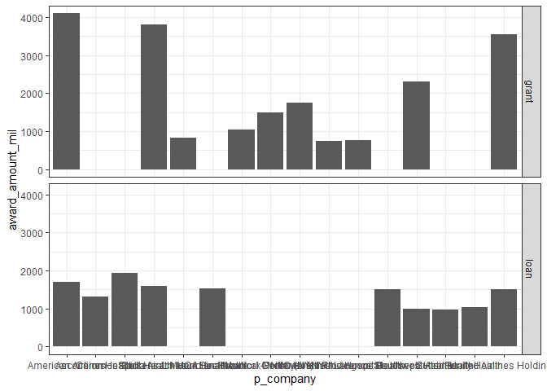
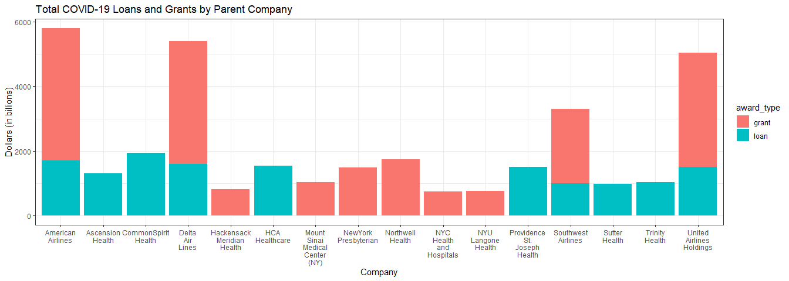

Part 3: Top Parent Company Recipients
================

In part 2, we looked into how grant & loan money was distributed amongst
recipient companies. In part 3, we look more closely at the top 10
recipients.

## Load data

First, load the packages and read the data from part 1.

``` r
options(scipen = 999)
library(dplyr)
library(ggplot2) # for graphing
theme_set(theme_bw())

df <- read.csv('../data/formatted_loan_data_6_17.csv', header = TRUE)
```

## Analysis

##### What 10 parent companies received the most grant money? How about loans?

``` r
### add values grouped by parent company
loan.grant.df <- df %>%
  filter(p_company != '') %>% # remove companies without parents
  group_by(award_type, p_company) %>% # specify variables to summarize by
  summarize(award_amount = sum(award_amount))

### extract top 10 values for printing and graphing
top10.df <- loan.grant.df %>%
  ungroup() %>%
  group_by(award_type) %>%
  arrange(desc(award_amount)) %>% # arrange from highest to lowest
  slice(1:10)

print(top10.df)
```

    ## # A tibble: 20 x 3
    ## # Groups:   award_type [2]
    ##    award_type p_company                       award_amount
    ##    <fct>      <fct>                                  <dbl>
    ##  1 grant      American Airlines                 4100000000
    ##  2 grant      Delta Air Lines                   3800000000
    ##  3 grant      United Airlines Holdings          3540998013
    ##  4 grant      Southwest Airlines                2300000000
    ##  5 grant      Northwell Health                  1743209913
    ##  6 grant      NewYork-Presbyterian              1495732040
    ##  7 grant      Mount Sinai Medical Center (NY)   1038965325
    ##  8 grant      Hackensack Meridian Health         818993356
    ##  9 grant      NYU Langone Health                 770612930
    ## 10 grant      NYC Health and Hospitals           744868565
    ## 11 loan       CommonSpirit Health               1942154286
    ## 12 loan       American Airlines                 1700000000
    ## 13 loan       Delta Air Lines                   1600000000
    ## 14 loan       HCA Healthcare                    1538111767
    ## 15 loan       Providence St. Joseph Health      1504064276
    ## 16 loan       United Airlines Holdings          1500000000
    ## 17 loan       Ascension Health                  1314870847
    ## 18 loan       Trinity Health                    1036451028
    ## 19 loan       Southwest Airlines                1000000000
    ## 20 loan       Sutter Health                      979698946

Since we’re looking at the highest values, we may want to convert our
dollar units into millions of dollars for graphing.

``` r
top10.df$award_amount_mil <- top10.df$award_amount / 1000000

p1 <- ggplot(top10.df %>% group_by(p_company)) +
  geom_bar(aes(x = p_company, y = award_amount_mil), stat = 'identity') +
  facet_grid(award_type ~ .)

p1
```

<!-- -->

This visualization shows that:

  - 4 of the top 10 loan recipients were also in the top 10 for money
    received in grants
  - a stacked bar graph may be a better option

So, let’s try a stacked bar graph.

``` r
top10.df$company_title <- gsub(' |-', '\n', top10.df$p_company) # wrap x-axis labels so they don't overlap

p2 <- ggplot(top10.df) +
  geom_bar(aes(x = company_title, y = award_amount_mil, fill = award_type), stat = 'identity') +
  labs(
    title = 'Total COVID-19 Loans and Grants by Parent Company',
    x = 'Company',
    y = 'Dollars (in billions)'
  )
p2
```

<!-- -->

This helps us better visualize the data that is mixed between loans and
grants with some overlapping companies. I want to note a couple of
observations:

  - All of the recipients that fit our criteria were either in the
    healthcare or airline industries
  - American, Delta, Southwest, and United Airlines received a massive
    mix of loans and grants

Let’s look a bit more into the top recipients.

##### Of the top 10 companies, what percentage of grants did they receive relative to the whole?

``` r
all.grants <- sum(df$award_amount[df$award_type == 'grant'])
top.grants <- sum(top10.df$award_amount[top10.df$award_type == 'grant'])

perc.grants <- (top.grants / all.grants) * 100
perc.grants <- round(perc.grants, 2)

print(perc.grants)
```

    ## [1] 22.64

It turns out that 10 parent companies received about 22.64% of all grant
money.

##### Of the top 10 companies, what percentage of loans did they receive relative to the whole?

``` r
all.loans <- sum(df$award_amount[df$award_type == 'loan'])
top.loans <- sum(top10.df$award_amount[top10.df$award_type == 'loan'])

perc.loans <- (top.loans / all.loans) * 100
perc.loans <- round(perc.loans, 2)

print(perc.loans)
```

    ## [1] 13.54

The top 10 parent companies received about 13.54% of all grant money.
